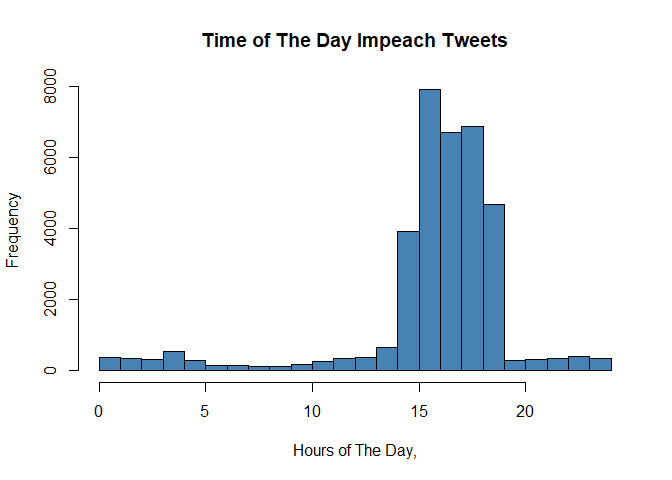
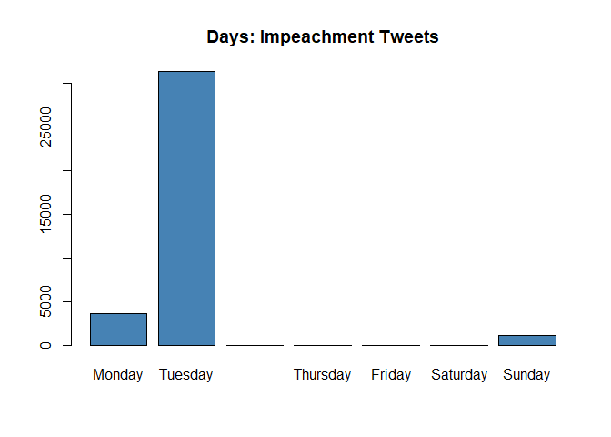
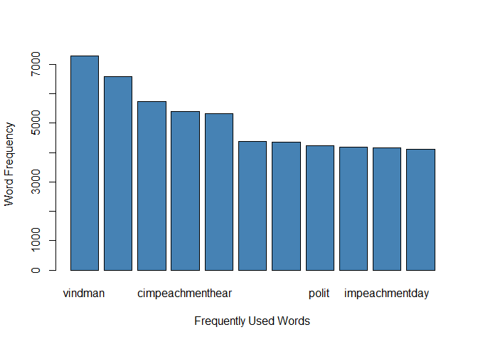
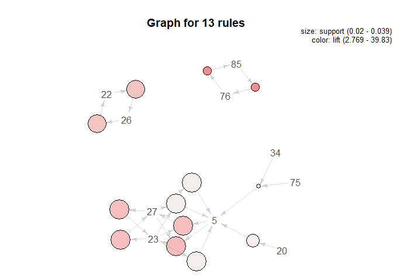
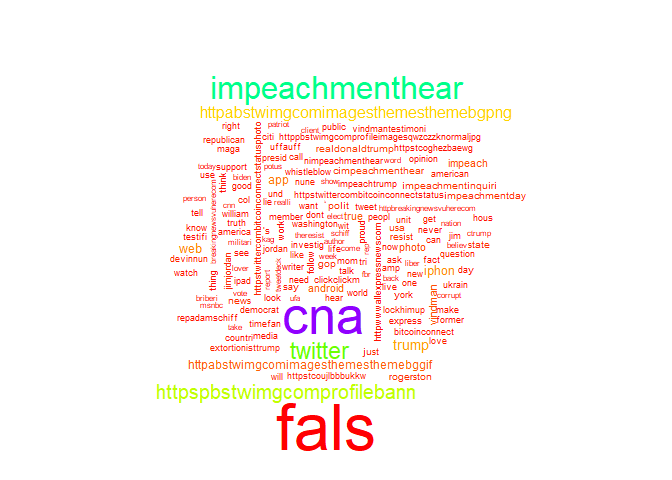

libraries

``` r
library(rtweet)
library(twitteR)
```

    ## 
    ## Attaching package: 'twitteR'

    ## The following object is masked from 'package:rtweet':
    ## 
    ##     lookup_statuses

``` r
library(stringr)
library(lubridate)
```

    ## 
    ## Attaching package: 'lubridate'

    ## The following object is masked from 'package:base':
    ## 
    ##     date

``` r
library(tm)
```

    ## Loading required package: NLP

TEXT AND SENTIMENTAL ANALYSIS FUNCTIONS

``` r
load("C:/Users/fb8502oa/Desktop/Github stuff/Tweet-Analysis/TextFunctions.RData")
load("C:/Users/fb8502oa/Desktop/Github stuff/Tweet-Analysis/PosNeg.RData")
```

DATA

``` r
load("C:/Users/fb8502oa/Desktop/Github stuff/Tweet-Analysis/Impeach.RData")
names(Impeach)
```

    ##  [1] "user_id"                 "status_id"              
    ##  [3] "created_at"              "screen_name"            
    ##  [5] "text"                    "source"                 
    ##  [7] "display_text_width"      "reply_to_status_id"     
    ##  [9] "reply_to_user_id"        "reply_to_screen_name"   
    ## [11] "is_quote"                "is_retweet"             
    ## [13] "favorite_count"          "retweet_count"          
    ## [15] "quote_count"             "reply_count"            
    ## [17] "hashtags"                "symbols"                
    ## [19] "urls_url"                "urls_t.co"              
    ## [21] "urls_expanded_url"       "media_url"              
    ## [23] "media_t.co"              "media_expanded_url"     
    ## [25] "media_type"              "ext_media_url"          
    ## [27] "ext_media_t.co"          "ext_media_expanded_url" 
    ## [29] "ext_media_type"          "mentions_user_id"       
    ## [31] "mentions_screen_name"    "lang"                   
    ## [33] "quoted_status_id"        "quoted_text"            
    ## [35] "quoted_created_at"       "quoted_source"          
    ## [37] "quoted_favorite_count"   "quoted_retweet_count"   
    ## [39] "quoted_user_id"          "quoted_screen_name"     
    ## [41] "quoted_name"             "quoted_followers_count" 
    ## [43] "quoted_friends_count"    "quoted_statuses_count"  
    ## [45] "quoted_location"         "quoted_description"     
    ## [47] "quoted_verified"         "retweet_status_id"      
    ## [49] "retweet_text"            "retweet_created_at"     
    ## [51] "retweet_source"          "retweet_favorite_count" 
    ## [53] "retweet_retweet_count"   "retweet_user_id"        
    ## [55] "retweet_screen_name"     "retweet_name"           
    ## [57] "retweet_followers_count" "retweet_friends_count"  
    ## [59] "retweet_statuses_count"  "retweet_location"       
    ## [61] "retweet_description"     "retweet_verified"       
    ## [63] "place_url"               "place_name"             
    ## [65] "place_full_name"         "place_type"             
    ## [67] "country"                 "country_code"           
    ## [69] "geo_coords"              "coords_coords"          
    ## [71] "bbox_coords"             "status_url"             
    ## [73] "name"                    "location"               
    ## [75] "description"             "url"                    
    ## [77] "protected"               "followers_count"        
    ## [79] "friends_count"           "listed_count"           
    ## [81] "statuses_count"          "favourites_count"       
    ## [83] "account_created_at"      "verified"               
    ## [85] "profile_url"             "profile_expanded_url"   
    ## [87] "account_lang"            "profile_banner_url"     
    ## [89] "profile_background_url"  "profile_image_url"

TWEET SUMMARY

``` r
summary(Impeach$retweet_count)
```

    ##     Min.  1st Qu.   Median     Mean  3rd Qu.     Max. 
    ##    0.000    0.000    0.000    2.209    0.000 3493.000

``` r
summary(Impeach$favorite_count)
```

    ##     Min.  1st Qu.   Median     Mean  3rd Qu.     Max. 
    ##    0.000    0.000    0.000    7.961    2.000 8991.000

``` r
#looking at the fav retweet
Impeach$text[Impeach$favorite_count==8991] # this is the most retweeted tweet
```

    ## [1] "Vindman and Schiff are essentially acknowledging that Vindman was the whistleblower’s source. They’re also both saying that neither of them know who the whistleblower is. So they’re both lying. #ImpeachmentHearings #StopTheSchiffShow"

Summary: This is the most retweet and ‘fav’ tweet during the Trump’s
impeachment hearing.

"Vindman and Schiff are essentially acknowledging that Vindman was the
whistleblower’s source. They’re also both saying that neither of them
know who the whistleblower is. So they’re both lying.

TIME STAMP FOR THE TWEETS

``` r
#time stamps for the tweets
Impeach$date = ymd_hms(Impeach$created_at)
Impeach$hour = hour(Impeach$date)+ minute(Impeach$date)/60
hist(Impeach$hour, main = "Time of The Day Impeach Tweets", xlab = "Hours of The Day,", col = "steelblue", breaks =24)
```



Summary: Most of the tweets were created in the night time. From the
14th hour. of the day to the 18th hour.

DAYS OF THE WEEK.

``` r
Impeach$day = weekdays(as.Date(Impeach$date))
Impeach$day = factor(Impeach$day, levels = c("Monday", "Tuesday", "Wednesday", "Thursday", "Friday", "Saturday", "Sunday"))
barplot(table(Impeach$day), col = "Steelblue", main = "Days: Impeachment Tweets")
```

 Summary:
People mostly tweeted on Tuesdays. Trump’s hearing started at 1pm on
Tuesday.

TWEET CLEANING

``` r
Impeach.clean1 = textScrubber(Impeach)
Impeach.clean1$text[1:20]
```

    ##  [1] "that was my duty vindmanimpeachmenthearings"                                                                                                                                                                                                                                       
    ##  [2] "ok jordan impeachmenthearings"                                                                                                                                                                                                                                                     
    ##  [3] "so powerfulill be fine for telling the truthimpeachmenthearings"                                                                                                                                                                                                                   
    ##  [4] "republicans are only serving to reinforce they have no defenceimpeachmenthearings they are merely trying to smear col vindman whichdoes not exonerate realdonaldtrump for his attempted bribery"                                                                                   
    ##  [5] "castor once again clearly demonstrating there is no cogent defence hereimpeachmenthearings"                                                                                                                                                                                        
    ##  [6] "jim jordan is grandstandingstill no substanceimpeachmenthearings"                                                                                                                                                                                                                  
    ##  [7] "devinnunes really what is your point impeachmenthearings do you have information to suggest otherwise"                                                                                                                                                                             
    ##  [8] "oh manminutes can feel like a lifetime impeachmenthearings"                                                                                                                                                                                                                        
    ##  [9] "vindman i call myself never partisanso greatimpeachmenthearings"                                                                                                                                                                                                                   
    ## [10] "someome please tell jim jordan hillaryclinton got more votesimpeachmenthearings"                                                                                                                                                                                                   
    ## [11] "castor implying col vindman would work for ukraine omg really this is so ridiculousimpeachmenthearings"                                                                                                                                                                            
    ## [12] "once again trying to name the whistleblower jim jordan is awfulimpeachmenthearings really no substance at all"                                                                                                                                                                     
    ## [13] "jennifer williams seems to be very clearly distancing vp from this whole mess impeachmenthearings"                                                                                                                                                                                 
    ## [14] "jim jordan is going to smear col vindman this is awful jim jordan is dreadful impeachmenthearings"                                                                                                                                                                                 
    ## [15] "when asked if hes a never trumper lt col vindman says hes a never partisan what a truly honorable military man its shameful hes having his integrity falsely attacked by unamerican gop trump sycophants impeachmenthearings devinnunes jimjordan repratcliffe"                    
    ## [16] "jimjordan isnt fit to shine lt col vindmans shoes jordans false attacks on an active duty service member amp purple heart recipient calling him a leaker amp impugning his honesty are despicable amp unamerican gymjordan impeachmenthearings ukraineextortion ohiogop gop"       
    ## [17] "excuse me repmiketurner but rudely attacking an honorable man in uniform amp not even allowing him to finish his responses isnt a good look for someone like you who has only served as an ambulance chaser but wants to get reelected impeachmenthearings ukrainebribery shameful"
    ## [18] "repchrisstewart stop lying to the american people impeachmenthearings"                                                                                                                                                                                                             
    ## [19] "and that goes for you too repbradwenstrup dont you realize how disgraceful it looks when you attack a serviceman telling the truth and cut him off so rudely no decency impeachmenthearings kakistocracy"                                                                          
    ## [20] "jim jordan just lies and lies and lies and covers up crimes thats pretty much all he ever does impeachmenthearings americanidiot"

``` r
Impeach.tweets = clean.text(Impeach.clean1$text)
Impeach.tweets[20:40]
```

    ##  [1] "jim jordan just lies and lies and lies and covers up crimes thats pretty much all he ever does impeachmenthearings americanidiot"                                                                                                                                                                                                      
    ##  [2] "why did you report your concerns lt col vindmanbecause that was my dutytruthmatters impeachmenthearings vindmantestimony"                                                                                                                                                                                                              
    ##  [3] "truth ukrainebribery impeachmenthearings"                                                                                                                                                                                                                                                                                              
    ##  [4] "impeachmenthearings why waste the publics time and waste tons of money on phony investigationsjust cut to the chaseyou cant accept the voters decision to elect donald trump as president"                                                                                                                                             
    ##  [5] "impeachmenthearings jim jordan while questioning the intelligence committee witness had his aha moment when he said oh so thats when it happened"                                                                                                                                                                                      
    ##  [6] "all the demarcatesxan do with there questions is try and restore credibility to there witnesses really these peole have nothing nextimpeachmenthearings"                                                                                                                                                                               
    ##  [7] "impeachmenthearings wow shifty just got caught in his own lie wake up demacrats thought he didn’t know who the whistleblower wasthought he didn’t know what agency he was from<U+0001F914> as stated on fridaycome onthis self proclaimed ruling class are using you guys at every turnmeful what it really says amp not just state them as facts"
    ##  [8] "these witnesses are not working out so well either i see<U+0001F602><U+0001F602><U+0001F602> shifty gonna be left holding a bag of rocks in a boat taking on water at a rapid speed impeachmenthearinas from<U+0001F914> as stated on fridaycome onthis self proclaimed ruling class are using you guys at every turnmeful what it really says amp not just state them as facts"
    ##  [9] "so we are trying realdonaldtrumpfor the crimes of joebiden this is what i am hearing from these witnesses demacrats thank yiur leaders for what transpires after this you wull be lucky to have a say in govt afteryrs not just the nextimpeachmenthearings"                                                                           
    ## [10] "all the demacratic lawmakers are putting on a show with no substanceenough they are all making fools of themselves witnesses said no crime committedbut they thought inappropriateits an opinion nextall they can do is try and pull at heart strings impeachmenthearings"                                                             
    ## [11] "vidmanimpeachmenthearings"                                                                                                                                                                                                                                                                                                             
    ## [12] "wooooooowwwww jimjordan just distorted the credibility for thesethen morrison is gonna come in and collaborate that he didn’t trust the curnal impeachmenthearings"                                                                                                                                                                    
    ## [13] "let’s talk about iraq now because you have been seen as an uncredited able witness and i’m going to pull heart strings this is a slapin the face to all our men and women in uniform<U+0001F621> these questions have no place here impeachmenthearings strings impeachmenthearingsturnmeful what it really says amp not just state them as facts"
    ## [14] "kudos to patrick maloney wow great summary for the rest of us questions on point impeachmenthearings"                                                                                                                                                                                                                                  
    ## [15] "the rs in the impeachmenthearings are just scary you wouldnt leave them in charge of a houseplant theyd water it with the efflusions of their top donor amp idiocracy style proclaim the corpse to be thriving in a whole new way while bragging abt their greatgrandpas farm"                                                         
    ## [16] "last week the oktrumper complained that the witnesses didn’t have first hand knowledge of the call so what’s your complaint this week withcredible witnesses who have first hand knowledge the call impeachmenthearings"                                                                                                               
    ## [17] "mr maloney just addressed lt col as mr but different rules lolimpeachmenthearings"                                                                                                                                                                                                                                                     
    ## [18] "impeachmenthearings this will go nowhereworse luck would love to see dumpy fucked out on his ear but that vindman<U+0001F621><U+0001F621><U+0001F621> doesn’t he just look like the kind of sneaky prick who who would snitch to the principal at school to gain brownie points would so like to bust hisrnmeful what it really says amp not just state them as facts"
    ## [19] "msnbc vp impeachmenthearings secondladyi bet mother will not let jennifer williams near mike pence ever again now"                                                                                                                                                                                                                     
    ## [20] "msnbc impeachmenthearings repchrisstewartrepuglican chris stewart is a pocall repuglicans are"                                                                                                                                                                                                                                         
    ## [21] "msnbc elisestefanik impeachmenthearingselise stefanik is that mean girl in grade school high school college and then the workplace that no one likes she callson everything"

Summary: These tweets look clean enough.

Corpus cleaning

``` r
#loading the data as corpus
Impeach.tweets = Corpus(VectorSource(Impeach))

#Convert all text to lower case
Impeach.tweets = tm_map(Impeach.tweets, content_transformer(tolower))
```

    ## Warning in tm_map.SimpleCorpus(Impeach.tweets,
    ## content_transformer(tolower)): transformation drops documents

``` r
# Remove punctuations
Impeach.tweets <- tm_map(Impeach.tweets, removePunctuation)
```

    ## Warning in tm_map.SimpleCorpus(Impeach.tweets, removePunctuation):
    ## transformation drops documents

``` r
# Remove numbers
Impeach.tweets <- tm_map(Impeach.tweets, removeNumbers)
```

    ## Warning in tm_map.SimpleCorpus(Impeach.tweets, removeNumbers):
    ## transformation drops documents

``` r
# Remove english common stopwords
Impeach.tweets <- tm_map(Impeach.tweets, removeWords, stopwords("english"))
```

    ## Warning in tm_map.SimpleCorpus(Impeach.tweets, removeWords,
    ## stopwords("english")): transformation drops documents

``` r
# Text stemming
Impeach.tweets <- tm_map(Impeach.tweets, stemDocument)
```

    ## Warning in tm_map.SimpleCorpus(Impeach.tweets, stemDocument):
    ## transformation drops documents

Replacing some

``` r
Space <- content_transformer(function (x , pattern ) gsub(pattern, " ", x))

Impeach.tweets <- tm_map(Impeach.tweets, Space, "/")
```

    ## Warning in tm_map.SimpleCorpus(Impeach.tweets, Space, "/"): transformation
    ## drops documents

``` r
Impeach.tweets <- tm_map(Impeach.tweets, Space, "@")
```

    ## Warning in tm_map.SimpleCorpus(Impeach.tweets, Space, "@"): transformation
    ## drops documents

``` r
Impeach.tweets <- tm_map(Impeach.tweets, Space, "\\|")
```

    ## Warning in tm_map.SimpleCorpus(Impeach.tweets, Space, "\\|"):
    ## transformation drops documents

``` r
Impeach.tweets <- tm_map(Impeach.tweets, stripWhitespace)
```

    ## Warning in tm_map.SimpleCorpus(Impeach.tweets, stripWhitespace):
    ## transformation drops documents

TMD

``` r
Impeach.TDM = TermDocumentMatrix(Impeach.tweets)
Impeach.mat = as.matrix(Impeach.TDM)
Impeach.mat[1:10, 1:20]
```

    ##            Docs
    ## Terms       1 2 3  4 5 6 7 8 9 10 11 12 13 14 15 16 17 18 19 20
    ##   aaaawint  0 0 0  3 0 0 0 0 0  0  0  0  0  0  0  0  0  0  0  0
    ##   aaerdek   0 0 0  1 0 0 0 0 0  0  0  0  0  0  0  0  0  0  0  0
    ##   aaffirm   0 0 0  1 0 0 0 0 0  0  0  0  0  0  0  0  0  0  0  0
    ##   aaguilera 0 0 0  1 0 0 0 0 0  0  0  0  0  0  0  0  0  0  0  0
    ##   aairbus   0 0 0  1 0 0 0 0 0  0  0  0  0  0  0  0  0  0  0  0
    ##   aal       0 0 0  1 0 0 0 0 0  0  0  0  0  0  0  0  0  0  0  0
    ##   aalamo    0 0 0  4 0 0 0 0 0  0  0  0  0  0  0  0  0  0  0  0
    ##   aalex     0 0 0 13 0 0 0 0 0  0  0  0  0  0  0  0  0  0  0  0
    ##   aalfarok  0 0 0  1 0 0 0 0 0  0  0  0  0  0  0  0  0  0  0  0
    ##   aaltami   0 0 0  1 0 0 0 0 0  0  0  0  0  0  0  0  0  0  0  0

Frequently used words

``` r
word.freq = sort(rowSums(Impeach.mat), decreasing = T)
barplot(word.freq[15:25], xlab = "Frequently Used Words", ylab = "Word Frequency", col = "Steelblue")
```



``` r
word.freq[1: 50]
```

    ##                                     fals 
    ##                                   140321 
    ##                                      cna 
    ##                                   106913 
    ##                          impeachmenthear 
    ##                                    59437 
    ##                                  twitter 
    ##                                    37074 
    ##              httpspbstwimgcomprofilebann 
    ##                                    29218 
    ##    httpabstwimgcomimagesthemesthemebgpng 
    ##                                    19366 
    ##                                    trump 
    ##                                    14906 
    ##                                    iphon 
    ##                                    13194 
    ##                                      web 
    ##                                    12301 
    ##                                      app 
    ##                                    11194 
    ##    httpabstwimgcomimagesthemesthemebggif 
    ##                                     8893 
    ##                                  android 
    ##                                     8759 
    ##                                     true 
    ##                                     7915 
    ##                                  impeach 
    ##                                     7481 
    ##                                  vindman 
    ##                                     7283 
    ##                                    photo 
    ##                                     6588 
    ##                          realdonaldtrump 
    ##                                     5744 
    ##                         cimpeachmenthear 
    ##                                     5407 
    ##                                      usa 
    ##                                     5335 
    ##                                   resist 
    ##                                     4377 
    ##                       impeachmentinquiri 
    ##                                     4361 
    ##                                    polit 
    ##                                     4243 
    ##                                rogerston 
    ##                                     4191 
    ##                           impeachmentday 
    ##                                     4149 
    ##                                      gop 
    ##                                     4101 
    ##                                     news 
    ##                                     4097 
    ##                                    state 
    ##                                     4047 
    ##                                     just 
    ##                                     3846 
    ##                                     like 
    ##                                     3522 
    ##                                 devinnun 
    ##                                     3451 
    ##                                      new 
    ##                                     3449 
    ##                                jimjordan 
    ##                                     3431 
    ##                                lockhimup 
    ##                                     3382 
    ##                        extortionisttrump 
    ##                                     3268 
    ## httpstwittercombitcoinconnectstatusphoto 
    ##                                     3244 
    ##                       httpstcoujlbbbukkw 
    ##                                     3244 
    ##                                     unit 
    ##                                     3212 
    ##                                     will 
    ##                                     3165 
    ##                                     love 
    ##                                     3139 
    ##                                   presid 
    ##                                     3121 
    ##                                     nune 
    ##                                     3035 
    ##                               republican 
    ##                                     2933 
    ##                                 question 
    ##                                     2786 
    ##                                     hear 
    ##                                     2717 
    ##                                      wit 
    ##                                     2653 
    ##                                     know 
    ##                                     2625 
    ##                                      col 
    ##                                     2611 
    ##                                     call 
    ##                                     2575 
    ##                                     time 
    ##                                     2553 
    ##                                      get 
    ##                                     2545

``` r
# Remove english common stopwords
Impeach.tweets <- tm_map(Impeach.tweets, removeWords, c(stopwords("english"), "will", "use","today", "can", "come", "think", "watch", "day", "app"))
```

    ## Warning in tm_map.SimpleCorpus(Impeach.tweets, removeWords,
    ## c(stopwords("english"), : transformation drops documents

``` r
word.freq[1:30]
```

    ##                                  fals 
    ##                                140321 
    ##                                   cna 
    ##                                106913 
    ##                       impeachmenthear 
    ##                                 59437 
    ##                               twitter 
    ##                                 37074 
    ##           httpspbstwimgcomprofilebann 
    ##                                 29218 
    ## httpabstwimgcomimagesthemesthemebgpng 
    ##                                 19366 
    ##                                 trump 
    ##                                 14906 
    ##                                 iphon 
    ##                                 13194 
    ##                                   web 
    ##                                 12301 
    ##                                   app 
    ##                                 11194 
    ## httpabstwimgcomimagesthemesthemebggif 
    ##                                  8893 
    ##                               android 
    ##                                  8759 
    ##                                  true 
    ##                                  7915 
    ##                               impeach 
    ##                                  7481 
    ##                               vindman 
    ##                                  7283 
    ##                                 photo 
    ##                                  6588 
    ##                       realdonaldtrump 
    ##                                  5744 
    ##                      cimpeachmenthear 
    ##                                  5407 
    ##                                   usa 
    ##                                  5335 
    ##                                resist 
    ##                                  4377 
    ##                    impeachmentinquiri 
    ##                                  4361 
    ##                                 polit 
    ##                                  4243 
    ##                             rogerston 
    ##                                  4191 
    ##                        impeachmentday 
    ##                                  4149 
    ##                                   gop 
    ##                                  4101 
    ##                                  news 
    ##                                  4097 
    ##                                 state 
    ##                                  4047 
    ##                                  just 
    ##                                  3846 
    ##                                  like 
    ##                                  3522 
    ##                              devinnun 
    ##                                  3451

Summary: These were some of the most frequently used words in people’s
tweets regarding the impeachment hearing.

Looking for word associations

``` r
findAssocs(Impeach.TDM, "vindman",.99)
```

    ## $vindman
    ##                                       sham 
    ##                                       1.00 
    ##                                    burisma 
    ##                                       1.00 
    ##                                  flashback 
    ##                                       1.00 
    ##                                    goldman 
    ##                                       1.00 
    ##                                       hoax 
    ##                                       1.00 
    ##                                    incoher 
    ##                                       1.00 
    ##                                 jacketless 
    ##                                       1.00 
    ##                                       lame 
    ##                                       1.00 
    ##                                   obstruct 
    ##                                       1.00 
    ##                                       penc 
    ##                                       1.00 
    ##                                 repstewart 
    ##                                       1.00 
    ##                                     retali 
    ##                                       1.00 
    ##                                      rumor 
    ##                                       1.00 
    ##                                    scandal 
    ##                                       1.00 
    ##                                     schiff 
    ##                                       1.00 
    ##                                    session 
    ##                                       1.00 
    ##                                      syria 
    ##                                       1.00 
    ##                                  testimoni 
    ##                                       1.00 
    ##                                     ukrain 
    ##                                       1.00 
    ##                                whistleblow 
    ##                                       1.00 
    ##                                    william 
    ##                                       0.99 
    ##                                     abject 
    ##                                       0.99 
    ##                                      accus 
    ##                                       0.99 
    ##                                 activeduti 
    ##                                       0.99 
    ##                                    address 
    ##                                       0.99 
    ##                                  afterward 
    ##                                       0.99 
    ##                                       amid 
    ##                                       0.99 
    ##                                        amp 
    ##                                       0.99 
    ##                                      antic 
    ##                                       0.99 
    ##                                     appear 
    ##                                       0.99 
    ##                                    applaud 
    ##                                       0.99 
    ##                                   approach 
    ##                                       0.99 
    ##                                     aren’t 
    ##                                       0.99 
    ##                                     assert 
    ##                                       0.99 
    ##                                     attack 
    ##                                       0.99 
    ##                                      attir 
    ##                                       0.99 
    ##                                      audit 
    ##                                       0.99 
    ##                                     beard” 
    ##                                       0.99 
    ##                                     bizarr 
    ##                                       0.99 
    ##                                     blasey 
    ##                                       0.99 
    ##                                       bled 
    ##                                       0.99 
    ##                                      bogus 
    ##                                       0.99 
    ##                                      boost 
    ##                                       0.99 
    ##                                     breach 
    ##                                       0.99 
    ##                                      broke 
    ##                                       0.99 
    ##                                       bruh 
    ##                                       0.99 
    ##                                     cancel 
    ##                                       0.99 
    ##                                    castor’ 
    ##                                       0.99 
    ##                                    chalupa 
    ##                                       0.99 
    ##          christmasiscomingnhttpstcoxfzvjhz 
    ##                                       0.99 
    ##                                       cite 
    ##                                       0.99 
    ##                                      claim 
    ##                                       0.99 
    ##                                    clearer 
    ##                                       0.99 
    ##                                      clock 
    ##                                       0.99 
    ##                                 closeddoor 
    ##                                       0.99 
    ##                                    closest 
    ##                                       0.99 
    ##                                      coerc 
    ##                                       0.99 
    ##                                        col 
    ##                                       0.99 
    ##                                     collus 
    ##                                       0.99 
    ##                                    colonel 
    ##                                       0.99 
    ##                                     coloss 
    ##                                       0.99 
    ##                                     compli 
    ##                                       0.99 
    ##                                    conclus 
    ##                                       0.99 
    ##                                    conduct 
    ##                                       0.99 
    ##                                   contrast 
    ##                                       0.99 
    ##                                   corrobor 
    ##                                       0.99 
    ##                                    counsel 
    ##                                       0.99 
    ##                                    credibl 
    ##                                       0.99 
    ##                                      daddo 
    ##                                       0.99 
    ##                                      damag 
    ##                                       0.99 
    ##                                     daytim 
    ##                                       0.99 
    ##                                        dct 
    ##                                       0.99 
    ##                                      defam 
    ##                                       0.99 
    ##                                  democrat’ 
    ##                                       0.99 
    ##                                   derelict 
    ##                                       0.99 
    ##                                    describ 
    ##                                       0.99 
    ##                                   descript 
    ##                                       0.99 
    ##                                     detail 
    ##                                       0.99 
    ##                                  detriment 
    ##                                       0.99 
    ##                                      devin 
    ##                                       0.99 
    ##                                     disbar 
    ##                                       0.99 
    ##                                   discharg 
    ##                                       0.99 
    ##                                    disclos 
    ##                                       0.99 
    ##                                    disdain 
    ##                                       0.99 
    ##                                 dishonesti 
    ##                                       0.99 
    ##                                  disintegr 
    ##                                       0.99 
    ##                                    dismiss 
    ##                                       0.99 
    ##                                     dispos 
    ##                                       0.99 
    ##                                     disput 
    ##                                       0.99 
    ##                         donimpeachmenthear 
    ##                                       0.99 
    ##                               electionnnlt 
    ##                                       0.99 
    ##                                      endem 
    ##                                       0.99 
    ##                                      entri 
    ##                                       0.99 
    ##                                      envoy 
    ##                                       0.99 
    ##                                    equival 
    ##                                       0.99 
    ##                                       evas 
    ##                                       0.99 
    ##                                       evid 
    ##                                       0.99 
    ##                                    eviscer 
    ##                                       0.99 
    ##                                    excerpt 
    ##                                       0.99 
    ##                                     explos 
    ##                                       0.99 
    ##                                     fabric 
    ##                                       0.99 
    ##                                     facial 
    ##                                       0.99 
    ##                                      filth 
    ##                                       0.99 
    ##                                  firsthand 
    ##                                       0.99 
    ##                                      fishi 
    ##                                       0.99 
    ##                                      fixat 
    ##                                       0.99 
    ##                                      flail 
    ##                                       0.99 
    ##                                   floodgat 
    ##                                       0.99 
    ##                                       flop 
    ##                                       0.99 
    ##                                     forbid 
    ##                                       0.99 
    ##                                    further 
    ##                                       0.99 
    ##                                 furthermor 
    ##                                       0.99 
    ##                                     gather 
    ##                                       0.99 
    ##                                   guiliani 
    ##                                       0.99 
    ##                                       guis 
    ##                                       0.99 
    ##                                      hadnt 
    ##                                       0.99 
    ##                                       haul 
    ##                                       0.99 
    ##                                       here 
    ##                                       0.99 
    ##                                    highest 
    ##                                       0.99 
    ##                                       hime 
    ##                                       0.99 
    ##                                     himher 
    ##                                       0.99 
    ##                                     hisher 
    ##                                       0.99 
    ##                                     horrid 
    ##                                       0.99 
    ##                                     horrif 
    ##                                       0.99 
    ##                                      hurri 
    ##                                       0.99 
    ##                                    imparti 
    ##                                       0.99 
    ##                   impeachmenthearingsnnufa 
    ##                                       0.99 
    ##                                      inabl 
    ##                                       0.99 
    ##                             inappropriate” 
    ##                                       0.99 
    ##                                      incap 
    ##                                       0.99 
    ##                                  ineptitud 
    ##                                       0.99 
    ##                               inflammatori 
    ##                                       0.99 
    ##                                      initi 
    ##                                       0.99 
    ##                                     inject 
    ##                                       0.99 
    ##                                     insinu 
    ##                                       0.99 
    ##                                   interrog 
    ##                                       0.99 
    ##                                    intimid 
    ##                                       0.99 
    ##                                   introduc 
    ##                                       0.99 
    ##                                      invok 
    ##                                       0.99 
    ##                                       ituf 
    ##                                       0.99 
    ##                        jobnimpeachmenthear 
    ##                                       0.99 
    ##                                  kavanaugh 
    ##                                       0.99 
    ##                                       kiev 
    ##                                       0.99 
    ##                                     lackey 
    ##                                       0.99 
    ##                                       lawd 
    ##                                       0.99 
    ##                                     leaker 
    ##                                       0.99 
    ##                                     lethal 
    ##                                       0.99 
    ##                                lewandowski 
    ##                                       0.99 
    ##                                      lmfao 
    ##                                       0.99 
    ##                                    loyalti 
    ##                                       0.99 
    ##                                        ltc 
    ##                                       0.99 
    ##                                     lucrat 
    ##                                       0.99 
    ##                                   lutsenko 
    ##                                       0.99 
    ##                                   meanwhil 
    ##                                       0.99 
    ##                                      meddl 
    ##                                       0.99 
    ##                                 memorandum 
    ##                                       0.99 
    ##                                      merit 
    ##                                       0.99 
    ##                                        mil 
    ##                                       0.99 
    ##                                  military” 
    ##                                       0.99 
    ##                                     missil 
    ##                                       0.99 
    ##                                      namen 
    ##                                       0.99 
    ##                                     ndevin 
    ##                                       0.99 
    ##                                    nervous 
    ##                                       0.99 
    ##                                    ngordon 
    ##                                       0.99 
    ##                                nhouseintel 
    ##                                       0.99 
    ##                                    nitpick 
    ##                                       0.99 
    ##                                       nnat 
    ##                                       0.99 
    ##                                      nnbut 
    ##                                       0.99 
    ##                                      nncan 
    ##                                       0.99 
    ##                      nndevinnunesisanidiot 
    ##                                       0.99 
    ##                                    nnelect 
    ##                                       0.99 
    ##                                    nneveri 
    ##                                       0.99 
    ##                                  nneveryon 
    ##                                       0.99 
    ##                                     nnhave 
    ##                                       0.99 
    ##                                      nnhey 
    ##                                       0.99 
    ##                                      nnjim 
    ##                                       0.99 
    ##                                     nnmari 
    ##                                       0.99 
    ##                                       nnmr 
    ##                                       0.99 
    ##                                      nnnot 
    ##                                       0.99 
    ##                                      nnnow 
    ##                                       0.99 
    ##                                     nnnune 
    ##                                       0.99 
    ##                                    nnpleas 
    ##                                       0.99 
    ##                                     nnthat 
    ##                                       0.99 
    ##                                     nnthis 
    ##                                       0.99 
    ##                                      nntri 
    ##                                       0.99 
    ##                                    nntrump 
    ##                                       0.99 
    ##                           nntuesdaythought 
    ##                                       0.99 
    ##                                     nnwell 
    ##                                       0.99 
    ##                                      nnwho 
    ##                                       0.99 
    ##                                     nnwith 
    ##                                       0.99 
    ##                                      nnyou 
    ##                                       0.99 
    ##                                   nonexist 
    ##                                       0.99 
    ##                                        nso 
    ##                                       0.99 
    ##                                      nthis 
    ##                                       0.99 
    ##                                     ntoday 
    ##                                       0.99 
    ##                      ntrumpbribedandextort 
    ##                                       0.99 
    ##                               ntrumpextort 
    ##                                       0.99 
    ##                                       nune 
    ##                                       0.99 
    ##                                      offer 
    ##                                       0.99 
    ##                                   ondemand 
    ##                                       0.99 
    ##                                       onto 
    ##                                       0.99 
    ##                                      oppon 
    ##                                       0.99 
    ##                                       ouch 
    ##                                       0.99 
    ##                                    oversea 
    ##                                       0.99 
    ##                                      parna 
    ##                                       0.99 
    ##                                       peni 
    ##                                       0.99 
    ##                    peoplennimpeachmenthear 
    ##                                       0.99 
    ##                                     perhap 
    ##                                       0.99 
    ##                                    perjuri 
    ##                                       0.99 
    ##                                      phone 
    ##                                       0.99 
    ##                                      plead 
    ##                                       0.99 
    ##                                    please” 
    ##                                       0.99 
    ##                                     pompeo 
    ##                                       0.99 
    ##                                    portion 
    ##                                       0.99 
    ##                                       poss 
    ##                                       0.99 
    ##                                     potus’ 
    ##                                       0.99 
    ##                                     predic 
    ##                                       0.99 
    ##                                       prep 
    ##                                       0.99 
    ##                                    preview 
    ##                                       0.99 
    ##                                    proceed 
    ##                                       0.99 
    ##                                    process 
    ##                                       0.99 
    ##                                     prompt 
    ##                                       0.99 
    ##                                     proper 
    ##                                       0.99 
    ##                                  putinpush 
    ##                                       0.99 
    ##               questioningnnimpeachmenthear 
    ##                                       0.99 
    ##                 questionsnnimpeachmenthear 
    ##                                       0.99 
    ##                                    rampant 
    ##                                       0.99 
    ##                                 ratcliffe’ 
    ##                                       0.99 
    ##                                    ratliff 
    ##                                       0.99 
    ##                                      rebuk 
    ##                                       0.99 
    ##                                  recollect 
    ##                                       0.99 
    ##                                   redirect 
    ##                                       0.99 
    ##                                     releas 
    ##                                       0.99 
    ##                                     remark 
    ##                                       0.99 
    ##                                     replay 
    ##                                       0.99 
    ##                                  reprehens 
    ##                                       0.99 
    ##                                     repudi 
    ##                                       0.99 
    ##                                    request 
    ##                                       0.99 
    ##                                     resign 
    ##                                       0.99 
    ##                                     respek 
    ##                                       0.99 
    ##                                        roh 
    ##                                       0.99 
    ##                                 rosenstein 
    ##                                       0.99 
    ##                                        rot 
    ##                                       0.99 
    ##                                     rubber 
    ##                                       0.99 
    ##                                    russia’ 
    ##                                       0.99 
    ##                                    russia” 
    ##                                       0.99 
    ##                                   sanction 
    ##                                       0.99 
    ##                                      sayin 
    ##                                       0.99 
    ##                                       scam 
    ##                                       0.99 
    ##                                      scath 
    ##                                       0.99 
    ##                                     scheme 
    ##                                       0.99 
    ##                                      scold 
    ##                                       0.99 
    ##                                    scurril 
    ##                                       0.99 
    ##                                    segment 
    ##                                       0.99 
    ## sellingnnvindmantestimonynnimpeachmenthear 
    ##                                       0.99 
    ##                                      shake 
    ##                                       0.99 
    ##                                      shift 
    ##                                       0.99 
    ##                                      shown 
    ##                                       0.99 
    ##                                      slime 
    ##                                       0.99 
    ##                                   slimebal 
    ##                                       0.99 
    ##                                       slob 
    ##                                       0.99 
    ##                                     sloppi 
    ##                                       0.99 
    ##                                       sobr 
    ##                                       0.99 
    ##                                   solomon’ 
    ##                                       0.99 
    ##                                    somehow 
    ##                                       0.99 
    ##                                   soninlaw 
    ##                                       0.99 
    ##                                        sop 
    ##                                       0.99 
    ##                                       stab 
    ##                                       0.99 
    ##                                  statement 
    ##                                       0.99 
    ##                                   stefanik 
    ##                                       0.99 
    ##                                  stefanik’ 
    ##                                       0.99 
    ##                                   storylin 
    ##                                       0.99 
    ##                                 straightup 
    ##                                       0.99 
    ##                                     strike 
    ##                                       0.99 
    ##                                      strip 
    ##                                       0.99 
    ##                                     submit 
    ##                                       0.99 
    ##                                   substant 
    ##                                       0.99 
    ##                                      subtl 
    ##                                       0.99 
    ##                                    summari 
    ##                                       0.99 
    ##                                        svc 
    ##                                       0.99 
    ##                                        tab 
    ##                                       0.99 
    ##                                   takeaway 
    ##                                       0.99 
    ##                                    tarnish 
    ##                                       0.99 
    ##                                    testifi 
    ##                                       0.99 
    ##                             testifyingnnth 
    ##                                       0.99 
    ##                                     thisnn 
    ##                                       0.99 
    ##                                     throat 
    ##                                       0.99 
    ##                                   tireless 
    ##                                       0.99 
    ##                                       toll 
    ##                                       0.99 
    ##                                  tomorrow’ 
    ##                                       0.99 
    ##                                 transcript 
    ##                                       0.99 
    ##                                   trumper” 
    ##                                       0.99 
    ##                              trumpsondland 
    ##                                       0.99 
    ##                                trumpukrain 
    ##                                       0.99 
    ##                             trumpzelenskiy 
    ##                                       0.99 
    ##                      truthnimpeachmenthear 
    ##                                       0.99 
    ##                                    tuesday 
    ##                                       0.99 
    ##                                   ukraine’ 
    ##                                       0.99 
    ##                                   ukraine” 
    ##                                       0.99 
    ##                                  ukrainian 
    ##                                       0.99 
    ##                                   undertak 
    ##                                       0.99 
    ##                                    uniform 
    ##                                       0.99 
    ##                                      unlaw 
    ##                                       0.99 
    ##                                     unnerv 
    ##                                       0.99 
    ##                                   unprepar 
    ##                                       0.99 
    ##                                    unsecur 
    ##                                       0.99 
    ##                                      unsur 
    ##                                       0.99 
    ##                                      unusu 
    ##                                       0.99 
    ##                        upnnimpeachmenthear 
    ##                                       0.99 
    ##                                   upnnthat 
    ##                                       0.99 
    ##                                    valiant 
    ##                                       0.99 
    ##                                    verdict 
    ##                                       0.99 
    ##                                   vindaman 
    ##                                       0.99 
    ##                                    vindict 
    ##                                       0.99 
    ##                                   vindland 
    ##                                       0.99 
    ##                                   vindmann 
    ##                                       0.99 
    ##                                  vindmannn 
    ##                                       0.99 
    ##                                     vpotus 
    ##                                       0.99 
    ##                                      wacko 
    ##                                       0.99 
    ##                                  wednesday 
    ##                                       0.99 
    ##                                      week’ 
    ##                                       0.99 
    ##                                       whew 
    ##                                       0.99 
    ##                                      whini 
    ##                                       0.99 
    ##                      whistleblowernnschiff 
    ##                                       0.99 
    ##                             whistleblower’ 
    ##                                       0.99 
    ##                                       whoa 
    ##                                       0.99 
    ##                                      whove 
    ##                                       0.99 
    ##                                  williamsn 
    ##                                       0.99 
    ##                                   withhold 
    ##                                       0.99 
    ##                                   witness’ 
    ##                                       0.99 
    ##                                   witness” 
    ##                                       0.99 
    ##                                 wordsearch 
    ##                                       0.99 
    ##                                       wore 
    ##                                       0.99 
    ##                                     worthi 
    ##                                       0.99 
    ##                                   wouldn’t 
    ##                                       0.99 
    ##                                     wouldv 
    ##                                       0.99 
    ##                                       youd 
    ##                                       0.99 
    ##                                yovanivitch 
    ##                                       0.99 
    ##                                  zelenskyy 
    ##                                       0.99 
    ##                                    ‘strong 
    ##                                       0.99 
    ##                                    “burden 
    ##                                       0.99 
    ##                                  “burisma” 
    ##                                       0.99 
    ##                                       “col 
    ##                                       0.99 
    ##                                    “favor” 
    ##                                       0.99 
    ##                                  “hearsay” 
    ##                                       0.99 
    ##                                       “let 
    ##                                       0.99 
    ##                                       “mr” 
    ##                                       0.99 
    ##                                    “presid 
    ##                                       0.99 
    ##                                   “russian 
    ##                                       0.99 
    ##                                       “sir 
    ##                                       0.99 
    ##                                    “strong 
    ##                                       0.99 
    ##                                     “trump 
    ##                                       0.99 
    ##                                   “vindman 
    ##                                       0.99 
    ##                                        “ye 
    ##                                       0.99

Summary: These are all the words that were highly associated with
Vindman

LETS USE ASSOCIATION RULES TO FIND MORE ASSOCIATIONS.

``` r
library(arules)
```

    ## Loading required package: Matrix

    ## 
    ## Attaching package: 'arules'

    ## The following object is masked from 'package:tm':
    ## 
    ##     inspect

    ## The following objects are masked from 'package:base':
    ## 
    ##     abbreviate, write

``` r
library(arulesViz)
```

    ## Warning: package 'arulesViz' was built under R version 3.6.3

    ## Loading required package: grid

    ## Registered S3 method overwritten by 'seriation':
    ##   method         from 
    ##   reorder.hclust gclus

Transposing the matrix

``` r
temp = Impeach.mat
Impeach.trans = as(temp, "transactions")
```

    ## Warning in asMethod(object): matrix contains values other than 0 and 1!
    ## Setting all entries != 0 to 1.

``` r
temp[temp>1] = 1
Impeach.trans = as(temp, "transactions")
Impeach.rules = apriori(Impeach.trans, parameter = list(supp = 0.020))
```

    ## Apriori
    ## 
    ## Parameter specification:
    ##  confidence minval smax arem  aval originalSupport maxtime support minlen
    ##         0.8    0.1    1 none FALSE            TRUE       5    0.02      1
    ##  maxlen target   ext
    ##      10  rules FALSE
    ## 
    ## Algorithmic control:
    ##  filter tree heap memopt load sort verbose
    ##     0.1 TRUE TRUE  FALSE TRUE    2    TRUE
    ## 
    ## Absolute minimum support count: 3299 
    ## 
    ## set item appearances ...[0 item(s)] done [0.00s].
    ## set transactions ...[78 item(s), 164974 transaction(s)] done [0.02s].
    ## sorting and recoding items ... [19 item(s)] done [0.00s].
    ## creating transaction tree ... done [0.03s].
    ## checking subsets of size 1 2 3 done [0.00s].
    ## writing ... [13 rule(s)] done [0.00s].
    ## creating S4 object  ... done [0.00s].

I can have interactions because it would let me knit the code.

``` r
plot(Impeach.rules, method = "graph")
```



FREQUENTLY USED WORDS WORDCLOUD

``` r
library(wordcloud)
```

    ## Loading required package: RColorBrewer

``` r
wordcloud(words = names(word.freq), freq = word.freq, min.freq = 1000, col = rainbow(1000))
```


